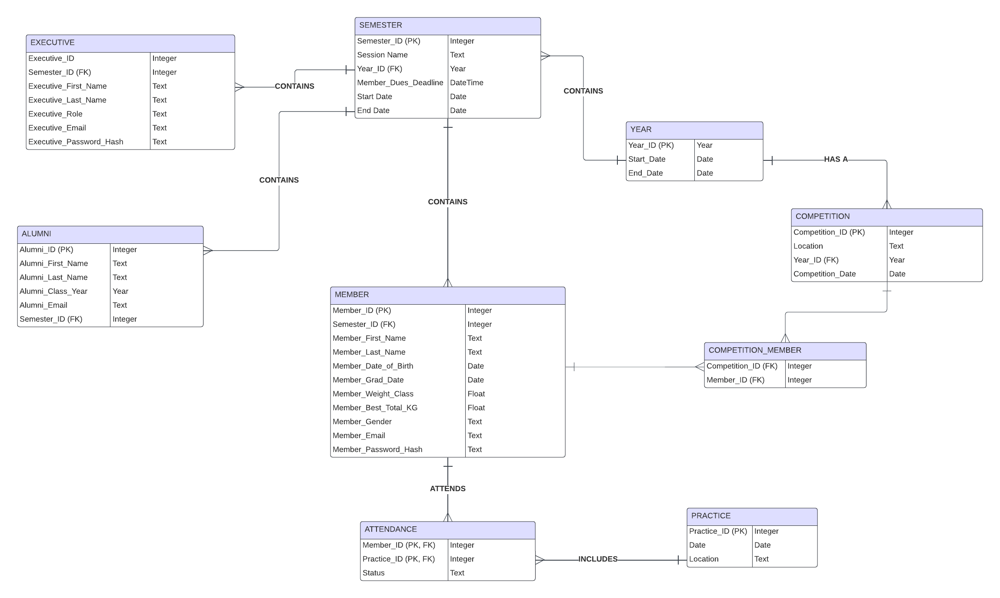

# Powerlifting Club Database

## Overview

This project aims to build a database for the Powerlifting Club at the University of Virginia (UVA). The database tracks member attendance, competition requirements, and membership information to streamline administrative tasks, provide accurate and accessible records, and enhance member engagement.

## Project Team

- **Youssef Cherrat**: Organization of business rules, database design (ERD Diagram, database selection), and frontend design choices.
- **Samay Jamakayala**: Frontend development, design aspects, and ensuring proper connection between frontend and backend.
- **Claire Kim**: Backend development using MySQL and Python.
- **Jaimin Thakkar**: Assisting backend development using MySQL and Python.

## Requirements

1. **Track member attendance**: Members must attend at least two practices per month.
2. **Admin modification rights**: Only admins can modify data.
3. **Track competition requirements**: Track competition participation per academic year.

## Description

Powerlifting is a strength sport consisting of three events: squat, bench, and deadlift. The total weight in KG determines placings in competitions. The Powerlifting Club at UVA requires members to attend practices and participate in sanctioned competitions. The database will manage member information, attendance records, and competition participation efficiently.

## Business Rules

1. **Year**: One-to-many relationship with Semester and Competition.
2. **Semester**: Maintains member and alumni lists.
3. **Member**: Information includes ID, semester link, first name, last name, date of birth, grad date, weight class, best total KG, gender, email, and password hash.
4. **Alumni**: Alumni list maintained each semester, non-login records for contact information.
5. **Practice**: Many-to-many relationship with Member through Attendance.
6. **Attendance**: Each member must attend at least two practices per month.
7. **Executive**: Updated each semester, non-member executives with roles and login credentials.
8. **Competition**: Many-to-many relationship with Member through Competition_Member.
9. **Competition_Member**: Junction table linking Member and Competition.

## Entity Relationship Diagram (ERD)



## Database Schema

The database schema consists of the following tables:

- `Year`
- `Semester`
- `Member`
- `Executive`
- `Alumni`
- `Practice`
- `Attendance`
- `Competition`
- `Competition_Member`

## SQL Scripts

### Table Creation

```sql
CREATE TABLE Year (
    Year_ID INTEGER PRIMARY KEY,
    Start_Date DATE,
    End_Date DATE
);

CREATE TABLE Semester (
    Semester_ID INTEGER PRIMARY KEY,
    Year_ID INTEGER,
    Session_Name TEXT,
    Member_Dues_Deadline DATETIME,
    Start_Date DATE,
    End_Date DATE,
    FOREIGN KEY (Year_ID) REFERENCES Year(Year_ID)
);

CREATE TABLE Member (
    Member_ID INTEGER PRIMARY KEY,
    Semester_ID INTEGER,
    Member_First_Name TEXT,
    Member_Last_Name TEXT,
    Member_Date_of_Birth DATE,
    Member_Grad_Date DATE,
    Member_Weight_Class FLOAT,
    Member_Best_Total_KG FLOAT,
    Member_Gender TEXT,
    Member_Email TEXT,
    Member_Password_Hash TEXT,
    FOREIGN KEY (Semester_ID) REFERENCES Semester(Semester_ID)
);

CREATE TABLE Executive (
    Executive_ID INTEGER PRIMARY KEY,
    Semester_ID INTEGER,
    Executive_First_Name TEXT,
    Executive_Last_Name TEXT,
    Executive_Role TEXT,
    Executive_Email TEXT,
    Executive_Password_Hash TEXT,
    FOREIGN KEY (Semester_ID) REFERENCES Semester(Semester_ID)
);

CREATE TABLE Alumni (
    Alumni_ID INTEGER PRIMARY KEY,
    Alumni_First_Name TEXT,
    Alumni_Last_Name TEXT,
    Alumni_Class_Year INTEGER,
    Alumni_Email TEXT,
    Semester_ID INTEGER,
    FOREIGN KEY (Semester_ID) REFERENCES Semester(Semester_ID)
);

CREATE TABLE Practice (
    Practice_ID INTEGER PRIMARY KEY,
    Date DATE,
    Location TEXT
);

CREATE TABLE Attendance (
    Member_ID INTEGER,
    Practice_ID INTEGER,
    Status TEXT,
    PRIMARY KEY (Member_ID, Practice_ID),
    FOREIGN KEY (Member_ID) REFERENCES Member(Member_ID),
    FOREIGN KEY (Practice_ID) REFERENCES Practice(Practice_ID)
);

CREATE TABLE Competition (
    Competition_ID INTEGER PRIMARY KEY,
    Location TEXT,
    Year_ID INTEGER,
    Competition_Date DATE,
    FOREIGN KEY (Year_ID) REFERENCES Year(Year_ID)
);

CREATE TABLE Competition_Member (
    Competition_ID INTEGER,
    Member_ID INTEGER,
    PRIMARY KEY (Competition_ID, Member_ID),
    FOREIGN KEY (Competition_ID) REFERENCES Competition(Competition_ID),
    FOREIGN KEY (Member_ID) REFERENCES Member(Member_ID)
);
```

### Create Insert Statemntes for Tables

```sql
-- Insert into Year
INSERT INTO Year (Year_ID, Start_Date, End_Date) VALUES (1, '2024-01-01', '2024-12-31');
INSERT INTO Year (Year_ID, Start_Date, End_Date) VALUES (2, '2025-01-01', '2025-12-31');

-- Insert into Semester
INSERT INTO Semester (Semester_ID, Year_ID, Session_Name, Member_Dues_Deadline, Start_Date, End_Date) 
VALUES (1, 1, 'Spring 2024', '2024-01-15 23:59:59', '2024-01-10', '2024-05-20'),
       (2, 1, 'Fall 2024', '2024-08-15 23:59:59', '2024-08-20', '2024-12-15'),
       (3, 2, 'Spring 2025', '2025-01-15 23:59:59', '2025-01-10', '2025-05-20');

-- Insert into Member
INSERT INTO Member (Member_ID, Semester_ID, Member_First_Name, Member_Last_Name, Member_Date_of_Birth, Member_Grad_Date, Member_Weight_Class, Member_Best_Total_KG, Member_Gender, Member_Email, Member_Password_Hash)
VALUES (1, 1, 'John', 'Doe', '2000-01-01', '2024-05-20', 75.0, 500.0, 'Male', 'john.doe@example.com', 'hash1'),
       (2, 1, 'Jane', 'Smith', '2001-02-01', '2025-05-20', 60.0, 450.0, 'Female', 'jane.smith@example.com', 'hash3'),
       (3, 2, 'Mike', 'Brown', '1999-03-03', '2024-12-15', 82.5, 600.0, 'Male', 'mike.brown@example.com', 'hash4'),
       (4, 3, 'Emily', 'Davis', '2002-04-04', '2025-12-15', 70.0, 550.0, 'Female', 'emily.davis@example.com', 'hash5');

-- Insert into Executive
INSERT INTO Executive (Executive_ID, Semester_ID, Executive_First_Name, Executive_Last_Name, Executive_Role, Executive_Email, Executive_Password_Hash)
VALUES (1, 1, 'Alice', 'Smith', 'President', 'alice.smith@example.com', 'hash2'),
       (2, 2, 'Robert', 'Lee', 'Vice President', 'robert.lee@example.com', 'hash6'),
       (3, 3, 'Linda', 'White', 'Secretary', 'linda.white@example.com', 'hash7');

-- Insert into Alumni
INSERT INTO Alumni (Alumni_ID, Alumni_First_Name, Alumni_Last_Name, Alumni_Class_Year, Alumni_Email, Semester_ID)
VALUES (1, 'Bob', 'Johnson', 2023, 'bob.johnson@example.com', 1),
       (2, 'Sara', 'Williams', 2022, 'sara.williams@example.com', 1),
       (3, 'Tom', 'Wilson', 2023, 'tom.wilson@example.com', 2);

-- Insert into Practice
INSERT INTO Practice (Practice_ID, Date, Location)
VALUES (1, '2024-02-01', 'Gym A'),
       (2, '2024-02-03', 'Gym B'),
       (3, '2024-02-05', 'Gym C'),
       (4, '2024-08-21', 'Gym A');

-- Insert into Attendance
INSERT INTO Attendance (Member_ID, Practice_ID, Status)
VALUES (1, 1, 'Present'),
       (1, 2, 'Present'),
       (1, 3, 'Absent'),
       (2, 2, 'Present'),
       (2, 4, 'Present'),
       (3, 3, 'Present'),
       (4, 4, 'Absent');

-- Insert into Competition
INSERT INTO Competition (Competition_ID, Location, Year_ID, Competition_Date)
VALUES (1, 'City Arena', 1, '2024-03-15'),
       (2, 'Downtown Gym', 1, '2024-10-10'),
       (3, 'UVA Stadium', 2, '2025-04-20');

-- Insert into Competition_Member
INSERT INTO Competition_Member (Competition_ID, Member_ID)
VALUES (1, 1),
       (1, 2),
       (2, 1),
       (2, 3),
       (3, 4);
```

### Select staements for each table

```sql
A SQL select statement for each table that shows all rows.
SELECT * FROM Year;
SELECT * FROM Semester;
SELECT * FROM Member;
SELECT * FROM Executive;
SELECT * FROM Alumni;
SELECT * FROM Practice;
SELECT * FROM Attendance;
SELECT * FROM Competition;
SELECT * FROM Competition_Member;
```

### Select statement that shows only Female Member List
    
    ```sql
SELECT * FROM Member
WHERE Member_Gender = 'Female';
```
### Query to group attendance and count number of practices attended by each member

```sql
SELECT Member_ID, COUNT(Practice_ID) AS NumberOfPractices
FROM Attendance
WHERE Status = 'Present'
GROUP BY Member_ID;
```

### SQL statement on master detail report - Member and Competition_Member tables

```sql
SELECT 
    Member.Member_ID,
    Member.Member_First_Name,
    Member.Member_Last_Name,
    Practice.Practice_ID,
    Practice.Date AS Practice_Date,
    Practice.Location AS Practice_Location,
    Attendance.Status AS Attendance_Status
FROM 
    Member
JOIN 
    Attendance ON Member.Member_ID = Attendance.Member_ID
JOIN 
    Practice ON Attendance.Practice_ID = Practice.Practice_ID
ORDER BY 
    Member.Member_ID, Practice.Date;
```